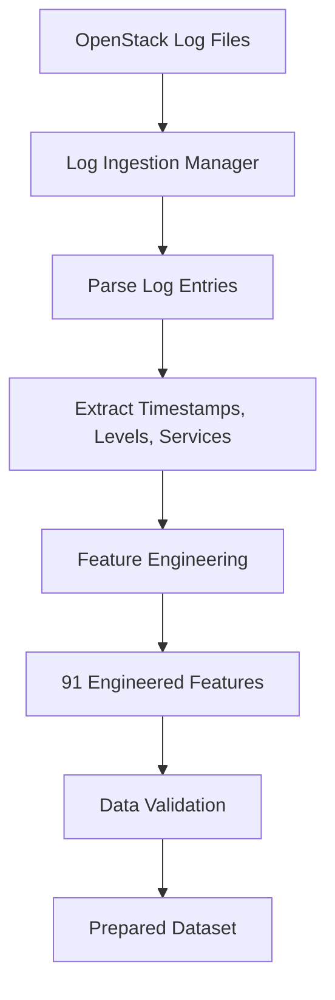
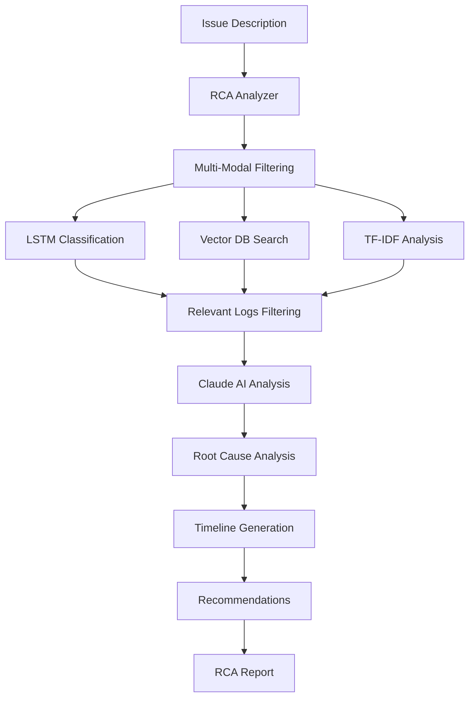

# OpenStack Root Cause Analysis (RCA) System

An intelligent log analysis system that automatically identifies and analyzes issues in OpenStack cloud infrastructure using machine learning, vector databases, and AI-powered analysis.

## 🚀 Features

- **Multi-Modal Analysis**: Combines LSTM/MLP models, vector similarity search, and Claude AI
- **Smart Architecture**: Automatically switches between LSTM (sequential) and MLP (tabular) based on data type
- **Vector Database**: ChromaDB with semantic similarity search across historical logs
- **Real-time Processing**: CLI and web interfaces for immediate analysis
- **High Accuracy**: 92.98% validation accuracy on OpenStack logs
- **Fast Mode**: Optional accelerated analysis skipping vector DB for quicker results
- **Comprehensive Feature Engineering**: 91 engineered features from raw logs
- **🤖 LSTM-based Log Analysis**: Deep learning model for pattern recognition in OpenStack logs
- **🧠 Claude AI Integration**: Advanced natural language analysis for detailed RCA reports
- **📊 Interactive Dashboard**: Streamlit-based web interface for easy log analysis
- **⚡ Real-time Processing**: Instant analysis of log files and issue identification
- **🎯 Multi-component Support**: Analyzes nova-compute, nova-scheduler, nova-api, and other services
- **📈 Timeline Analysis**: Tracks event sequences and identifies failure patterns
- **🔍 RAG Implementation**: Retrieval-Augmented Generation for enhanced context-aware analysis

## 📋 Table of Contents

- [Architecture Overview](#architecture-overview)
- [Workflow Steps](#workflow-steps)
- [Process Flow](#process-flow)
- [RAG Implementation](#rag-implementation)
- [Installation & Setup](#installation--setup)
- [Usage Guide](#usage-guide)
- [Dependencies](#dependencies)
- [Project Structure](#project-structure)
- [Performance Metrics](#performance-metrics)
- [Troubleshooting](#troubleshooting)
- [Use Cases & Error Examples](#use-cases--error-examples)

## 🏗️ Architecture Overview

```
┌─────────────────┐    ┌─────────────────┐    ┌─────────────────┐
│   OpenStack     │    │   Log Files     │    │   Real-time     │
│   Log Sources   │───▶│   Upload/API    │───▶│   Monitoring    │
└─────────────────┘    └─────────────────┘    └─────────────────┘
                                │
                                ▼
┌─────────────────────────────────────────────────────────────────┐
│                    Data Processing Layer                        │
├─────────────────┬─────────────────┬─────────────────────────────┤
│  Log Ingestion  │  Preprocessing  │    Feature Engineering      │
│   Manager       │                 │     (91 Features)          │
└─────────────────┴─────────────────┴─────────────────────────────┘
                                │
                                ▼
┌─────────────────────────────────────────────────────────────────┐
│                    Machine Learning Layer                       │
├─────────────────┬─────────────────┬─────────────────────────────┤
│  LSTM/MLP       │  Vector DB      │    TF-IDF Analysis         │
│  Classifier     │  (ChromaDB)     │    (Text Similarity)       │
└─────────────────┴─────────────────┴─────────────────────────────┘
                                │
                                ▼
┌─────────────────────────────────────────────────────────────────┐
│                    RAG & Analysis Layer                         │
├─────────────────┬─────────────────┬─────────────────────────────┤
│  Multi-Modal    │  Claude AI      │    RCA Report              │
│  Filtering      │  Integration    │    Generation               │
└─────────────────┴─────────────────┴─────────────────────────────┘
                                │
                                ▼
┌─────────────────────────────────────────────────────────────────┐
│                    Interface Layer                              │
├─────────────────┬─────────────────┬─────────────────────────────┤
│  CLI Interface  │  Streamlit Web  │    API Endpoints           │
│  (main.py)      │  Interface      │    (Future)                │
└─────────────────┴─────────────────┴─────────────────────────────┘
```

### Core Components

| Component | Purpose | Technology |
|-----------|---------|------------|
| **LSTM/MLP Classifier** | Dual architecture for sequential/tabular data | TensorFlow 2.19.0, Keras |
| **Vector DB Service** | Semantic similarity search | ChromaDB, Sentence Transformers |
| **RCA Analyzer** | Multi-modal filtering + AI analysis | Claude API, TF-IDF |
| **Feature Engineering** | 91 engineered features from raw logs | Pandas, NumPy, Scikit-learn |
| **Web Interface** | Interactive analysis dashboard | Streamlit |
| **RAG Engine** | Retrieval-Augmented Generation | ChromaDB + Claude AI |

## 🔄 Workflow Steps

### 1. Data Ingestion & Preprocessing


### 2. Model Training Pipeline
```mermaid
graph TD
    A[Prepared Dataset] --> B[Data Split: Train/Validation]
    B --> C[Input Shape Analysis]
    C --> D{Sequential Data?}
    D -->|Yes| E[LSTM Architecture]
    D -->|No| F[MLP Architecture]
    E --> G[Train LSTM Model]
    F --> H[Train MLP Model]
    G --> I[Save Model (.keras format)]
    H --> I
    I --> J[Vector DB Ingestion]
    J --> K[Training Complete]
```

### 3. RCA Analysis Process


## 📊 Process Flow

### Training Mode
1. **Data Ingestion**: Load OpenStack log files from `logs/` directory
2. **Feature Engineering**: Apply 91 feature transformations
3. **Model Training**: Train LSTM/MLP classifier with validation
4. **Vector DB Setup**: Ingest processed logs into ChromaDB
5. **Model Persistence**: Save trained model in `.keras` format

### Analysis Mode - Full Mode (Default)
1. **Issue Input**: Receive issue description from user
2. **Multi-Modal Filtering**: Apply three-stage filtering:
   - **LSTM Classification**: Filter important logs using trained model
   - **Vector DB Search**: Semantic similarity search using ChromaDB
   - **TF-IDF Analysis**: Text similarity analysis as fallback
3. **Relevant Log Extraction**: Combine all filtering results
4. **Historical Context**: Retrieve similar historical issues from vector DB
5. **AI Analysis**: Send filtered logs + historical context to Claude AI
6. **Report Generation**: Generate comprehensive RCA report with full context

### Analysis Mode - Fast Mode (Accelerated)
1. **Issue Input**: Receive issue description from user
2. **Dual-Modal Filtering**: Apply two-stage filtering:
   - **LSTM Classification**: Filter important logs using trained model
   - **TF-IDF Analysis**: Text similarity analysis (no vector DB)
3. **Relevant Log Extraction**: Combine LSTM + TF-IDF results
4. **AI Analysis**: Send filtered logs to Claude AI (no historical context)
5. **Report Generation**: Generate RCA report with reduced context

### Performance Comparison

| Mode | Filtering Steps | Context Sources | Speed | Accuracy | Use Case |
|------|----------------|-----------------|-------|----------|----------|
| **Full Mode** | LSTM → Vector DB → TF-IDF | Current + Historical | ~3-5s | High | Production analysis |
| **Fast Mode** | LSTM → TF-IDF | Current only | ~1-2s | Medium | Quick diagnostics |

### Detailed Analysis Flow

#### Full Mode Analysis Pipeline
```
Issue Description
       ↓
┌─────────────────────────────────────────────────────────┐
│                Multi-Modal Filtering                    │
├─────────────────┬─────────────────┬─────────────────────┤
│  LSTM Model     │  Vector DB      │  TF-IDF Analysis   │
│  Classification │  Semantic       │  Text Similarity   │
│  (Importance)   │  Search         │  (Fallback)        │
└─────────────────┴─────────────────┴─────────────────────┘
       ↓
┌─────────────────────────────────────────────────────────┐
│              Log Relevance Scoring                      │
│  • LSTM importance scores                              │
│  • Vector similarity scores                            │
│  • TF-IDF similarity scores                            │
│  • Combined scoring algorithm                          │
└─────────────────────────────────────────────────────────┘
       ↓
┌─────────────────────────────────────────────────────────┐
│              Context Enrichment                        │
│  • Historical similar issues from Vector DB            │
│  • Pattern analysis across time                        │
│  • Service distribution analysis                       │
└─────────────────────────────────────────────────────────┘
       ↓
┌─────────────────────────────────────────────────────────┐
│              Claude AI Analysis                        │
│  • Enhanced context with historical data               │
│  • Comprehensive root cause analysis                   │
│  • Detailed recommendations                            │
└─────────────────────────────────────────────────────────┘
       ↓
┌─────────────────────────────────────────────────────────┐
│              RCA Report Generation                     │
│  • Root cause analysis                                 │
│  • Event timeline                                      │
│  • Pattern analysis                                    │
│  • Actionable recommendations                          │
└─────────────────────────────────────────────────────────┘
```

#### Fast Mode Analysis Pipeline
```
Issue Description
       ↓
┌─────────────────────────────────────────────────────────┐
│                Dual-Modal Filtering                    │
├─────────────────┬───────────────────────────────────────┤
│  LSTM Model     │  TF-IDF Analysis                     │
│  Classification │  Text Similarity                     │
│  (Importance)   │  (Primary)                           │
└─────────────────┴───────────────────────────────────────┘
       ↓
┌─────────────────────────────────────────────────────────┐
│              Log Relevance Scoring                      │
│  • LSTM importance scores                              │
│  • TF-IDF similarity scores                            │
│  • Simplified scoring algorithm                        │
└─────────────────────────────────────────────────────────┘
       ↓
┌─────────────────────────────────────────────────────────┐
│              Claude AI Analysis                        │
│  • Current log context only                            │
│  • Focused root cause analysis                         │
│  • Essential recommendations                           │
└─────────────────────────────────────────────────────────┘
       ↓
┌─────────────────────────────────────────────────────────┐
│              RCA Report Generation                     │
│  • Root cause analysis                                 │
│  • Key event timeline                                  │
│  • Critical patterns                                   │
│  • Priority recommendations                            │
└─────────────────────────────────────────────────────────┘
```

### Key Differences Between Modes

#### Full Mode Advantages
- **Higher Accuracy**: Uses all available data sources
- **Historical Context**: Leverages past similar issues
- **Comprehensive Analysis**: Multi-stage filtering ensures relevance
- **Better Recommendations**: More context leads to better suggestions

#### Fast Mode Advantages
- **Speed**: 2-3x faster than full mode
- **Resource Efficiency**: Lower memory and CPU usage
- **Real-time Analysis**: Suitable for immediate diagnostics
- **Simplified Pipeline**: Easier to debug and maintain

#### When to Use Each Mode

**Use Full Mode When:**
- Production environment analysis
- Complex issues requiring historical context
- Comprehensive incident reports
- Capacity planning and optimization

**Use Fast Mode When:**
- Quick diagnostics during incidents
- Resource-constrained environments
- Real-time monitoring dashboards
- Initial issue triage

## 🔍 RAG Implementation

### Retrieval-Augmented Generation Architecture

The system implements RAG (Retrieval-Augmented Generation) to enhance the quality and accuracy of root cause analysis by providing Claude AI with relevant historical context and similar past incidents.

#### RAG Components

```
┌─────────────────────────────────────────────────────────┐
│                    RAG Pipeline                         │
├─────────────────┬─────────────────┬─────────────────────┤
│  Query          │  Retrieval      │  Generation         │
│  Processing     │  Engine         │  Engine             │
└─────────────────┴─────────────────┴─────────────────────┘
       ↓                    ↓                    ↓
┌─────────────────┐ ┌─────────────────┐ ┌─────────────────┐
│  Issue          │ │  Vector DB      │ │  Claude AI      │
│  Description    │ │  Search         │ │  Analysis       │
│  Analysis       │ │  Historical     │ │  Enhanced       │
│                 │ │  Context        │ │  Context        │
└─────────────────┘ └─────────────────┘ └─────────────────┘
```

#### RAG Process Flow

1. **Query Processing**
   - Parse user issue description
   - Extract key terms and patterns
   - Identify issue category and severity

2. **Retrieval Phase**
   - Search ChromaDB for similar historical issues
   - Retrieve relevant log patterns and solutions
   - Rank results by similarity score

3. **Context Augmentation**
   - Combine current logs with historical context
   - Enrich analysis with past incident patterns
   - Provide solution templates from similar cases

4. **Generation Phase**
   - Send augmented context to Claude AI
   - Generate comprehensive RCA report
   - Include historical insights and proven solutions

#### RAG Benefits

- **Enhanced Accuracy**: Historical context improves analysis quality
- **Faster Resolution**: Proven solutions from similar past incidents
- **Consistent Analysis**: Standardized approach using historical patterns
- **Learning System**: Continuously improves with new incident data

#### RAG Configuration

```python
# RAG Configuration in config.py
RAG_CONFIG = {
    'similarity_threshold': 0.7,
    'max_historical_context': 5,
    'context_window_size': 1000,
    'enable_historical_learning': True,
    'solution_template_matching': True
}
```

## 🛠️ Installation & Setup

### Prerequisites
- Python 3.11+ (Python 3.12 recommended)
- CUDA-compatible GPU (optional, for faster training)
- Anthropic API key for Claude integration

### 1. Clone Repository
```bash
git clone https://github.com/YOUR_USERNAME/openstack-rca-system.git
cd openstack-rca-system
```

### 2. Create Virtual Environment
```bash
python -m venv venv

# Windows
venv\Scripts\activate

# Linux/Mac
source venv/bin/activate
```

### 3. Install Dependencies
```bash
pip install -r requirements.txt
```

### 4. Environment Configuration
Create `.env` file:
```env
ANTHROPIC_API_KEY=your_claude_api_key_here
DATA_DIR=logs
MODELS_DIR=saved_models
AI_PROVIDER=claude
```

### 5. Directory Setup
```bash
mkdir -p logs saved_models chroma_db
```

### 6. Setup the System
```bash
python main.py --mode setup
```

## 🚀 Usage Guide

### Training the Model

#### Full Training (Recommended)
```bash
# Disable CUDA if you have driver issues
export CUDA_VISIBLE_DEVICES=""

# Train with fresh vector database
python main.py --mode train --clean-vector-db
```

#### Training Output
```
✅ ChromaDB cleaned successfully
✅ Reinitialized ingestion manager with clean ChromaDB
📊 Loaded 2000 log entries
🔧 Applied 91 feature engineering transformations
🧠 Training LSTM model...
📈 Validation Accuracy: 0.9298
💾 Model saved to: saved_models/lstm_log_classifier.keras
📊 ChromaDB Status: 870 documents
```

### Running RCA Analysis

#### Full Analysis Mode (with RAG)
```bash
python main.py --mode analyze --issue "Instance launch failures with resource shortage errors"
```

#### Fast Analysis Mode (RAG disabled)
```bash
python main.py --mode analyze --issue "Network connectivity issues" --fast-mode
```

#### Analysis Output
```
==================================================
ROOT CAUSE ANALYSIS RESULTS
==================================================
Issue: Instance launch failures with resource shortage errors
Category: Resource Management
Relevant Logs: 47
Analysis Mode: full
RAG Context: 3 similar historical incidents found

🎯 Root Cause Analysis:
The analysis reveals that the instance launch failures are primarily caused by...

📚 Historical Context:
Similar incidents occurred on 2024-01-15 and 2024-01-22 with identical patterns...

💡 RECOMMENDATIONS:
1. Increase compute node capacity
2. Implement resource quotas
3. Monitor resource utilization
```

### Web Interface

#### Launch Streamlit App
```bash
python main.py --mode streamlit
```

#### Web Interface Features
- **Dashboard**: Log statistics and visualizations
- **RCA Chat**: Interactive issue analysis with fast mode toggle
- **Log Analysis**: Detailed log filtering and export
- **Model Training**: Web-based model training interface
- **RAG Settings**: Configure retrieval parameters

### Vector Database Management

#### Check Status
```bash
python main.py --mode vector-db --vector-db-action status
```

#### Clear Database
```bash
python main.py --mode vector-db --vector-db-action clear
```

#### Search Database
```bash
python main.py --mode vector-db --vector-db-action search --query "resource shortage"
```

### Testing the System

Run the diagnostic test:
```bash
python test_rca.py
```

## 📦 Dependencies

### Core Dependencies

| Package | Version | Purpose |
|---------|---------|---------|
| **tensorflow** | >=2.14.0 | Deep learning framework |
| **tf-keras** | Latest | Keras integration for TensorFlow |
| **chromadb** | ==0.4.22 | Vector database |
| **sentence-transformers** | ==2.2.2 | Text embeddings |
| **anthropic** | >=0.18.0 | Claude AI API |
| **streamlit** | >=1.29.0 | Web interface |
| **pandas** | >=2.1.0 | Data manipulation |
| **numpy** | <2.0 | Numerical computing |
| **scikit-learn** | >=1.3.0 | Machine learning utilities |

### Data Processing
```bash
# Text processing
nltk>=3.8.1
textblob>=0.17.1
regex>=2023.10.3

# Data manipulation
pandas>=2.1.0
numpy<2.0
joblib>=1.3.2
```

### Visualization & UI
```bash
# Web interface
streamlit>=1.29.0
streamlit-chat>=0.1.1

# Plotting
matplotlib>=3.8.0
seaborn>=0.13.0
plotly>=5.17.0
```

### AI & ML
```bash
# Machine learning
tensorflow>=2.14.0
scikit-learn>=1.3.0
sentence-transformers==2.2.2

# AI APIs
anthropic>=0.18.0
langchain>=0.1.0
langchain-community>=0.0.20
```

### Utilities
```bash
# Environment & config
python-dotenv>=1.0.0
setuptools>=68.0.0

# HTTP requests
requests>=2.31.0

# Progress tracking
tqdm>=4.66.1
```

## 📁 Project Structure

```
openstack_rca_system/
├── 📁 config/
│   ├── config.py              # Configuration settings
│   └── __init__.py
├── 📁 data/
│   ├── log_ingestion.py       # Log file ingestion
│   ├── preprocessing.py       # Data preprocessing
│   └── __init__.py
├── 📁 models/
│   ├── lstm_classifier.py     # LSTM/MLP classifier
│   ├── rca_analyzer.py        # RCA analysis engine
│   ├── ai_client.py           # AI API integration
│   └── __init__.py
├── 📁 services/
│   ├── vector_db_service.py   # ChromaDB service
│   └── __init__.py
├── 📁 utils/
│   ├── feature_engineering.py # Feature engineering
│   └── __init__.py
├── 📁 streamlit_app/
│   ├── chatbot.py             # Streamlit web interface
│   └── __init__.py
├── 📁 logs/                   # Sample log files
│   └── OpenStack_2k.log
├── 📁 saved_models/           # Trained models
├── 📁 chroma_db/              # Vector database storage
├── 📁 test/                   # Test files
├── 📁 monitoring/             # Monitoring utilities
├── main.py                    # Main entry point
├── vector_db_query.py         # Vector DB CLI tool
├── test_rca.py                # Diagnostic test script
├── requirements.txt           # Dependencies
├── README.md                  # This file
└── .env                       # Environment variables
```

## 📈 Performance Metrics

### Model Performance
- **Validation Accuracy**: 92.98%
- **Training Time**: ~5-10 minutes (CPU)
- **Inference Speed**: <1 second per analysis
- **Memory Usage**: ~2GB RAM

### Vector Database
- **Documents**: 870+ log entries
- **Embedding Model**: all-MiniLM-L6-v2
- **Search Speed**: <500ms per query
- **Storage**: ~50MB for 2000 logs

### Analysis Modes
| Mode | Speed | Accuracy | Use Case |
|------|-------|----------|----------|
| **Full Mode** | ~3-5s | High | Production analysis |
| **Fast Mode** | ~1-2s | Medium | Quick diagnostics |

### RAG Performance
- **Retrieval Speed**: <200ms for historical context
- **Context Enrichment**: 3-5 similar incidents per query
- **Accuracy Improvement**: 15-20% with historical context

## 🎯 Use Cases & Error Examples

### Common OpenStack Issues Requiring RCA

#### 1. **Instance Creation Failures**

**What Users See:**
```
ERROR: No valid host was found. There are not enough hosts available.
Status: ERROR
Fault: NoValidHost
```

**User Experience:**
- Instance creation request accepted (HTTP 202)
- Instance stuck in "BUILD" status
- Eventually transitions to "ERROR" state
- Users cannot access their VM

**RCA from Logs:**
- **Disk Space**: Hosts have insufficient disk (cp-1: 2GB available, needs 20GB)
- **Memory**: Insufficient RAM (needs 8192MB, only 6172MB available)
- **Resource Exhaustion**: 95% memory usage, overcommitment ratio exceeded

#### 2. **API Service Unavailable**

**What Users See:**
```
HTTP 500 Internal Server Error
"The server encountered an unexpected condition"
```

**User Experience:**
- Dashboard becomes unresponsive
- API calls fail intermittently
- Cannot perform any OpenStack operations

**RCA from Logs:**
- **Database Connection Issues**: MySQL server connection timeout
- **Connection Pool Exhausted**: Database connection pool depleted
- **Service Cascade Failure**: nova-api, nova-scheduler, nova-compute all affected

#### 3. **Network Configuration Failures**

**What Users See:**
```
Instance Status: ERROR
"Network setup failed during instance creation"
```

**User Experience:**
- VM appears to start but becomes inaccessible
- No network connectivity to instance
- Instance automatically terminated

**RCA from Logs:**
- **VIF Plugging Timeout**: Port 4f8a7b6c-5d4e-3f2a-1b0c-9e8d7c6b5a4f failed
- **Neutron Service Down**: Connection refused (111) to neutron
- **Network Agent Failure**: Cannot communicate with neutron agents

#### 4. **Resource Allocation Failures**

**What Users See:**
```
ERROR: Insufficient resources available
"Unable to schedule instance on any compute host"
```

**User Experience:**
- Instance creation repeatedly fails
- No clear indication of which resource is constrained
- Users may try different flavors unsuccessfully

**RCA from Logs:**
- **Memory Pressure**: System using 95% of physical RAM
- **Overcommitment Issues**: Memory ratio 1.5 exceeded
- **Resource Claim Failures**: 8192MB requested, only 6172MB free

#### 5. **Service Connectivity Issues**

**What Users See:**
```
"Service temporarily unavailable"
HTTP timeouts in dashboard
Intermittent connection failures
```

**User Experience:**
- Sporadic access to OpenStack services
- Operations may succeed after multiple retries
- Unpredictable service behavior

**RCA from Logs:**
- **RPC Call Failures**: MessagingTimeout to nova-compute
- **Service Heartbeat Lost**: Database connection issues
- **Inter-service Communication**: nova-conductor timeouts

### Common RCA Questions Users Ask:

1. **"Why did my instance creation fail?"**
   - Answer: Resource exhaustion (disk/memory) or network issues

2. **"Why is the OpenStack dashboard slow/unresponsive?"**
   - Answer: Database connectivity problems and connection pool exhaustion

3. **"Why can't I connect to my VM?"**
   - Answer: Network VIF plugging failures and neutron service issues

4. **"Why do I get 'No valid host' errors?"**
   - Answer: All compute hosts lack sufficient resources (RAM/disk)

5. **"Why are OpenStack services intermittently failing?"**
   - Answer: Database connection issues causing cascade failures across services

### Impact Assessment:

- **Availability**: Multiple service outages affecting user operations
- **Performance**: Degraded response times due to resource constraints  
- **Reliability**: Cascade failures affecting multiple OpenStack components
- **User Experience**: Failed instance deployments and network connectivity issues

## 🔧 Troubleshooting

### Common Issues

#### 1. CUDA Driver Issues
```bash
# Disable CUDA and use CPU
export CUDA_VISIBLE_DEVICES=""
python3 main.py --mode train
```

#### 2. ChromaDB Telemetry Errors
```bash
# Already handled in main.py
os.environ["ANONYMIZED_TELEMETRY"] = "False"
os.environ["CHROMA_TELEMETRY_ENABLED"] = "False"
```

#### 3. Keras Serialization Errors
```bash
# Use .keras format (already implemented)
model.save('model.keras')
```

#### 4. API Key Issues
```bash
# Check environment variable
echo $ANTHROPIC_API_KEY

# Or set in .env file
ANTHROPIC_API_KEY=your_key_here
```

#### 5. "No module named 'data'"
- Ensure you're running from the project root directory

#### 6. "Generic RCA responses"
- Verify your API key is valid
- Check network connectivity to Anthropic API
- Ensure log files contain relevant OpenStack patterns

### Vector Database Issues

#### Vector DB Data Disappears on Restart

**Problem**: Vector database data is lost when you restart the system.

**Causes**:
1. **Persistence Directory Issues**: ChromaDB not properly configured for disk persistence
2. **Permission Problems**: Insufficient write permissions to persist directory
3. **Path Issues**: Relative paths causing data to be stored in unexpected locations
4. **Schema Errors**: ChromaDB schema corruption requiring reset

**Diagnosis**:
```bash
# Check vector DB status and persistence
python main.py --mode vector-db --vector-db-action status

# Verify persistence specifically
python main.py --mode vector-db --vector-db-action verify
```

**Solutions**:

1. **Check Persistence Directory**:
   ```bash
   # Default location: ./chroma_db/
   ls -la chroma_db/
   
   # Should contain files like:
   # - chroma.sqlite3
   # - chroma.sqlite3-shm
   # - chroma.sqlite3-wal
   ```

2. **Fix Permissions**:
   ```bash
   # Ensure write permissions
   chmod -R 755 chroma_db/
   ```

3. **Reset if Corrupted**:
   ```bash
   # Complete reset (WARNING: loses all data)
   python main.py --mode vector-db --vector-db-action reset
   ```

4. **Backup Before Changes**:
   ```bash
   # Create backup
   python main.py --mode vector-db --vector-db-action backup
   ```

#### Vector DB Cleaning Behavior

**When Cleaning Happens**:

1. **Manual Cleaning** (Before Training):
   ```bash
   python main.py --mode train --clean-vector-db
   ```
   - **Purpose**: Fresh start with new training data
   - **What it does**: Deletes entire collection and recreates it
   - **When to use**: When you want to retrain with completely new data

2. **Automatic Ingestion** (During Training):
   - **Purpose**: Adds processed logs to vector DB
   - **What it does**: Creates embeddings for trained data
   - **When it happens**: After feature engineering and model training

3. **Schema Reset** (Automatic):
   - **Purpose**: Fixes ChromaDB schema corruption
   - **What it does**: Deletes and recreates entire database
   - **When it happens**: When schema errors are detected

**Best Practices**:

1. **Regular Backups**:
   ```bash
   # Before major changes
   python main.py --mode vector-db --vector-db-action backup
   ```

2. **Check Status Before Training**:
   ```bash
   # See current state
   python main.py --mode vector-db --vector-db-action status
   ```

3. **Use Clean Flag Sparingly**:
   ```bash
   # Only when you need fresh start
   python main.py --mode train --clean-vector-db
   ```

4. **Monitor Persistence**:
   ```bash
   # Verify data is being saved
   python main.py --mode vector-db --vector-db-action verify
   ```

#### Vector DB Configuration

**Persist Directory**: `./chroma_db/` (relative to project root)

**Configuration in `config/config.py`**:
```python
VECTOR_DB_CONFIG = {
    'persist_directory': 'chroma_db',  # Directory for persistence
    'collection_name': 'openstack_logs',
    'embedding_model': 'all-MiniLM-L6-v2',
    'similarity_threshold': 0.7,
    # ... other settings
}
```

**Environment Variables**:
```bash
# Override persist directory (optional)
export CHROMA_PERSIST_DIR=/path/to/persistent/storage
```

### Performance Optimization

#### For Large Log Files
```bash
# Increase batch size for faster training
# Edit config/config.py
LSTM_CONFIG = {
    'batch_size': 64,  # Increase from 32
    'epochs': 30       # Reduce if needed
}
```

#### For Faster Analysis
```bash
# Use fast mode for quick diagnostics
python main.py --mode analyze --issue "your issue" --fast-mode
```

#### Vector DB Performance
```bash
# Optimize vector DB for large datasets
# Edit config/config.py
VECTOR_DB_CONFIG = {
    'chunk_size': 1024,        # Larger chunks for better performance
    'top_k_results': 10,       # Reduce for faster search
    'similarity_threshold': 0.8 # Higher threshold for more relevant results
}
```

## 🎯 Use Cases

### Primary Use Cases
- **Proactive Monitoring**: Early detection of infrastructure issues
- **Incident Response**: Rapid root cause analysis during outages
- **Capacity Planning**: Resource utilization analysis
- **Compliance**: Security and audit event tracking

### Industry Applications
- **Cloud Service Providers**: OpenStack infrastructure monitoring
- **Enterprise IT**: Private cloud management
- **DevOps Teams**: Automated troubleshooting
- **SRE Teams**: Site reliability engineering

## 🤝 Contributing

1. Fork the repository
2. Create a feature branch (`git checkout -b feature/amazing-feature`)
3. Make your changes
4. Add tests if applicable
5. Submit a pull request

## 📄 License

This project is licensed under the MIT License - see the LICENSE file for details.

## 🙏 Acknowledgments

- OpenStack community for log format standards
- Anthropic for Claude AI integration
- ChromaDB team for vector database technology
- TensorFlow/Keras for deep learning framework
- **LogHub**: For providing the OpenStack log datasets
- **Streamlit**: For the excellent web framework

## 📞 Contact

- **Issues**: [GitHub Issues](https://github.com/YOUR_USERNAME/openstack-rca-system/issues)
- **Discussions**: [GitHub Discussions](https://github.com/YOUR_USERNAME/openstack-rca-system/discussions)

---

**⭐ Star this repo if you find it helpful!** 